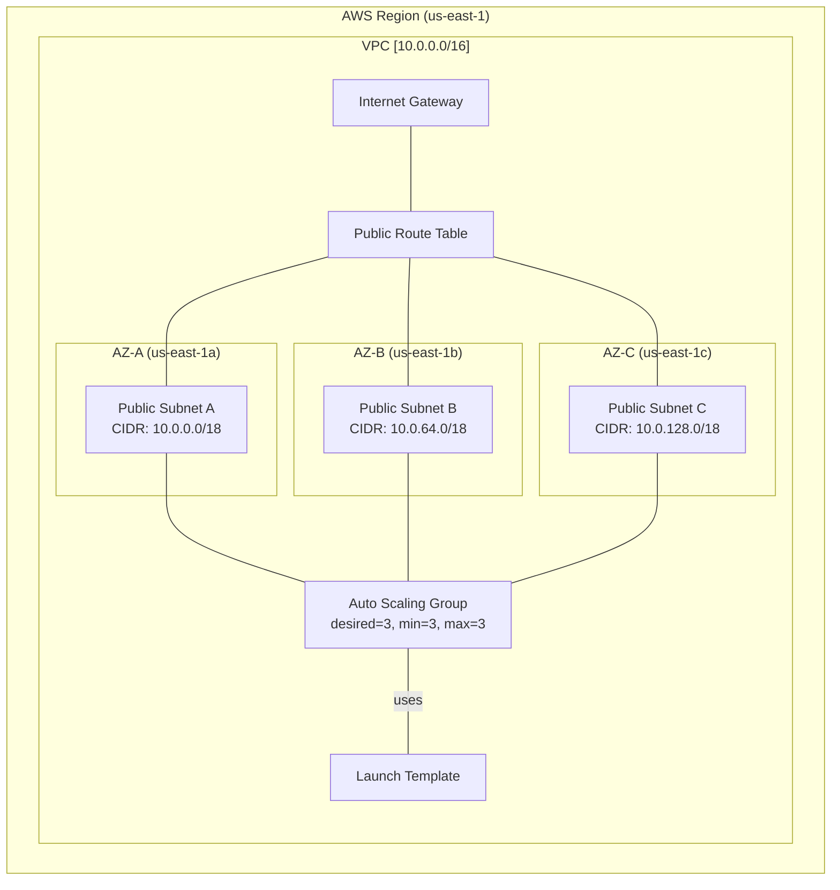

**Terraform Infrastructure for Multi-AZ EC2 Auto Scaling**

This repository contains Terraform code to provision a complete AWS infrastructure that automatically launches and maintains three EC2 instances—one in each of the first three Availability Zones—using an Auto Scaling Group with a Launch Template. The network components (VPC, subnets, Internet Gateway, route table) are all created by Terraform, so no manual pre‑creation of resources is required.

---

## Architecture Diagram



---

## Table of Contents

* [Prerequisites](#prerequisites)
* [Terraform Files](#terraform-files)
* [Variables](#variables)
* [Usage](#usage)
* [Outputs](#outputs)
* [Cleaning Up](#cleaning-up)

---

## Prerequisites

* [Terraform 1.1+](https://www.terraform.io/downloads.html)
* AWS CLI configured with credentials and region (or use an AWS profile)
* IAM permissions to create VPCs, Subnets, IGWs, Route Tables, Launch Templates, Auto Scaling Groups, and read AMIs

---

## Terraform Files

* `variables.tf` — defines input variables for region, VPC CIDR block, and instance type.
* `main.tf` — provisions:

  * AWS provider configuration
  * Data source to retrieve the first three Availability Zones
  * VPC (`aws_vpc`)
  * Public subnets (`aws_subnet` with `count = 3`)
  * Internet Gateway (`aws_internet_gateway`)
  * Route Table and associations (`aws_route_table`, `aws_route_table_association`)
  * Launch Template (`aws_launch_template`)
  * Auto Scaling Group (`aws_autoscaling_group` with `min_size = desired_capacity = max_size = 3`)
* `outputs.tf` — defines outputs for the Auto Scaling Group name and other resource IDs as needed.

---

## Variables

| Name            | Description               | Type   | Default       |
| --------------- | ------------------------- | ------ | ------------- |
| `aws_region`    | AWS region to deploy into | string | `us-east-1`   |
| `vpc_cidr`      | CIDR block for the VPC    | string | `10.0.0.0/16` |
| `instance_type` | EC2 instance type         | string | `t3.micro`    |

You can override variables via CLI or a `terraform.tfvars` file.

---

## Usage

1. **Initialize Terraform**

   ```bash
   terraform init
   ```

2. **Review the execution plan**

   ```bash
   terraform plan
   ```

3. **Apply the plan**

   ```bash
   terraform apply
   ```

Terraform will provision the network, subnets, and Auto Scaling Group with exactly three instances (one per AZ).

---

## Outputs

After `apply`, Terraform will output:

* `asg_instance_ids` — List of EC2 instance IDs in the Auto Scaling Group"

Use these outputs for integration with other modules or scripts.

---

## Cleaning Up

To destroy all resources created by this configuration, run:

```bash
terraform destroy
```

This will tear down the VPC, subnets, IGW, route table, launch template, and Auto Scaling Group.

---
